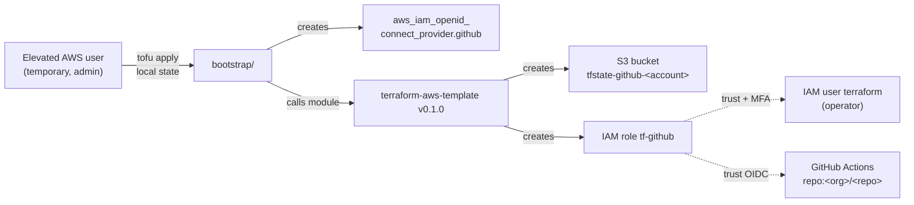

# bootstrap

One-time provisioning of the AWS state backend (S3 bucket) and scoped IAM
role (`tf-github`) that the parent terraform-github stack uses for all
subsequent operations. Calls the canonical
[dryvist/terraform-aws-template](https://github.com/dryvist/terraform-aws-template)
module at the pinned `v0.1.0` ref.

Run this **once**, with elevated AWS admin credentials. After the apply
succeeds and state is migrated into the new bucket, this directory is
effectively read-only — re-runs only happen if the template's pinned ref
bumps or if the IAM role / bucket need a documented configuration change.



## Requirements

Run `aws sts get-caller-identity` from this directory's shell. The ARN must
be an admin / elevated user with permission to:

- Create / read S3 buckets and bucket policies
- Create IAM roles, inline policies, and OIDC providers
- Read OIDC providers (for the import path if one already exists)

The operator IAM user that goes into `operator_user_arns` must have MFA
enabled in IAM. The role's trust policy enforces `aws:MultiFactorAuthPresent`,
so MFA-less sessions cannot AssumeRole regardless of the operator's other
permissions.

Tooling:

- OpenTofu ≥ 1.10 (for `use_lockfile`)
- `aws` CLI ≥ 2.x

## Usage

End-to-end flow: one-time bootstrap apply, then state migration, then a
one-time `~/.aws/config` profile addition. After that, the operator runs the
parent stack via `aws-vault exec tf-github -- terragrunt …`.

### 1. Apply the bootstrap

```bash
cd bootstrap
cp terraform.tfvars.example terraform.tfvars   # then edit with real values
tofu init
tofu apply
```

Expected resources on a clean account:

| Resource | What it is |
| --- | --- |
| `aws_iam_openid_connect_provider.github` | Account-wide GitHub Actions OIDC provider |
| `module.state_backend.aws_s3_bucket.state` | `tfstate-github-<account>` (AES256, versioning, public-access-blocked, TLS-only, 90-day noncurrent expiry) |
| `module.state_backend.aws_iam_role.terraform` | `tf-github` with combined trust (OIDC for the repo + MFA AssumeRole from the operator user) |
| `module.state_backend.aws_iam_role_policy.state` | Inline policy scoped to the new bucket only |

**OIDC provider already exists?** If another stack created it, the apply
errors with `EntityAlreadyExists`. Import once, then re-run apply:

```bash
tofu import aws_iam_openid_connect_provider.github \
  arn:aws:iam::<account-id>:oidc-provider/token.actions.githubusercontent.com
tofu apply
```

### 2. Migrate state into the new bucket

After the first apply, the bootstrap state is still local
(`bootstrap/terraform.tfstate`). Move it into the bucket it just created:

1. Capture the backend config from outputs:

   ```bash
   tofu output -raw backend_config
   ```

2. In `versions.tf`, uncomment the `backend "s3"` block and replace the
   `<account-id>` placeholder in the bucket name with your real account id
   (or paste the entire block from step 1's output).

3. Migrate:

   ```bash
   tofu init -migrate-state
   ```

   Confirm `yes` when prompted. The local `terraform.tfstate` lifts into
   `s3://tfstate-github-<account>/_bootstrap/terraform.tfstate`. Delete
   the local file once migration succeeds; the gitignored backup is fine
   to keep until you trust the migration.

### 3. Hand off to the operator

Once the role exists, the operator (whose IAM user ARN was in
`operator_user_arns`) needs a matching `aws-vault` profile. Add to
`~/.aws/config`:

```ini
[profile tf-github]
role_arn       = arn:aws:iam::<account-id>:role/tf-github
source_profile = <operator-source-profile>
mfa_serial     = arn:aws:iam::<account-id>:mfa/<operator-user>
region         = us-east-2
```

`<operator-source-profile>` is whatever profile holds the operator IAM
user's static keys (e.g. `terraform`). `<operator-user>` matches the
user portion of `operator_user_arns[i]`. The MFA serial is found at
IAM → Users → operator → Security credentials → "Assigned MFA device".

Verify:

```bash
aws-vault exec tf-github -- aws sts get-caller-identity
```

The returned ARN should be `arn:aws:sts::<account-id>:assumed-role/tf-github/<session>`,
not the operator user.

### 4. Run the parent stack

From the repo root (one level up):

```bash
aws-vault exec tf-github -- terragrunt init
aws-vault exec tf-github -- terragrunt plan
aws-vault exec tf-github -- terragrunt apply
```

`terragrunt.hcl` at the root is already configured to point at
`tfstate-github-<account>` under key `github/terraform.tfstate`. No
further edits required after the bootstrap.

### 5. What to do (or not) on subsequent changes

- Bumping the template's pinned ref → edit `module.state_backend.source`, run
  `tofu plan` to see the diff, apply if benign.
- Adding more operator users → append ARNs to `operator_user_arns` in
  `terraform.tfvars`, apply. The role's trust policy updates in place.
- Adding `.github/workflows/terragrunt.yml` to the parent stack → no
  bootstrap change. The role already trusts `repo:<github_org>/<github_repo>`
  on push to `main` and on pull_request.
- Wanting to widen `branch_pattern` → edit `terraform.tfvars`, apply.
- Wanting to widen the role's permissions → DON'T. Template is scoped to
  one bucket on purpose. New AWS responsibilities = new role from the
  template, not policy creep on this one.

## Cost

Free for this size. See the parent stack's
[`AGENTS.md` cost-policy section](../AGENTS.md#cost-policy) for the
matrix. S3 storage for one tiny state file + a few noncurrent versions is
~$0/month, no KMS, no DynamoDB.
